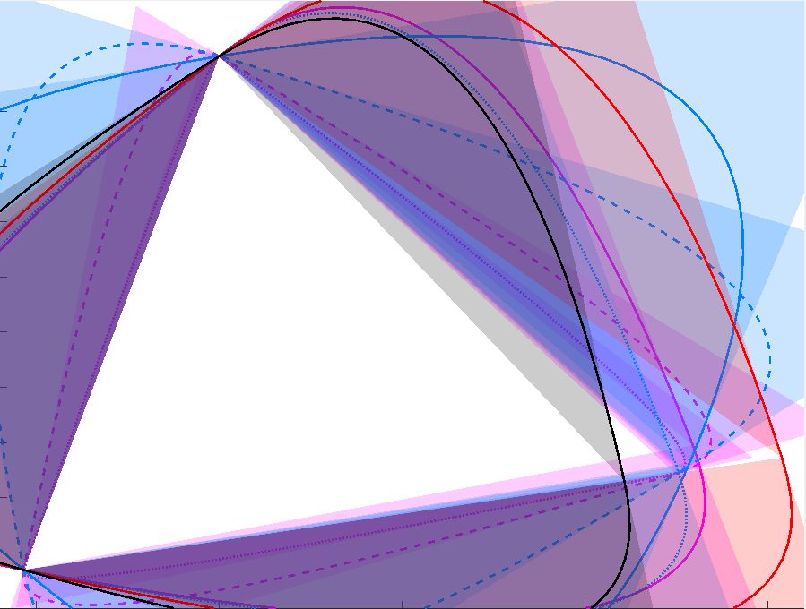

Contour(s)Plot
==============

Plots the boundary of 2D convex sets.

The convex sets are each defined by an oracle/function that maximizes a linear functional/inequality and returns a maximizer (i.e. a point in the convex set).

Such a function can be:

```matlab
function pt = circlef(lin)
% function that defines a circle of radius 1
	x = sdpvar;
	y = sdpvar;
	optimize(norm([x;y]) <= 1, -lin(1)*x-lin(2)*y);
	pt = [double(x); double(y)];
end

state = ContourInit(@circlef);
for i = 1:10
	state = ContourUpdate(@circlef, state);
	styles = struct;
	styles.fill = {'', 'FaceColor', [1 0 0], 'FaceAlpha', 0.2, 'LineStyle', 'none'};
	styles.bezier = {'-', 'Color', [1 0 0]};
	ContourPlot(state, styles);
end
```


Another example below, which required less than 100 oracles *in total* for the picture.



